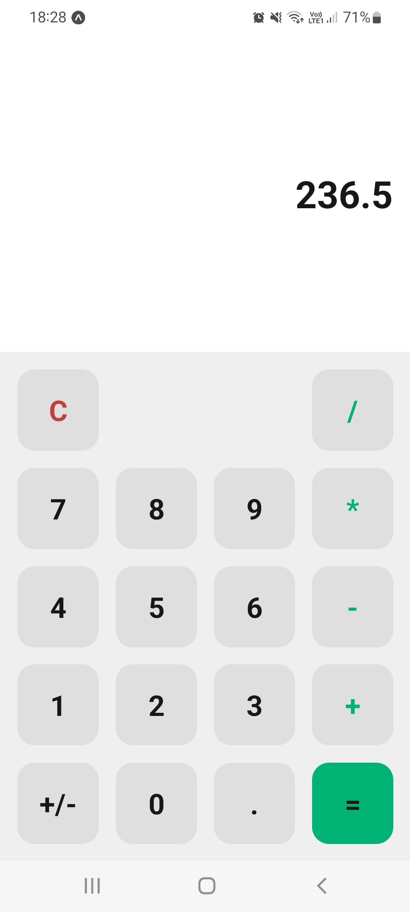
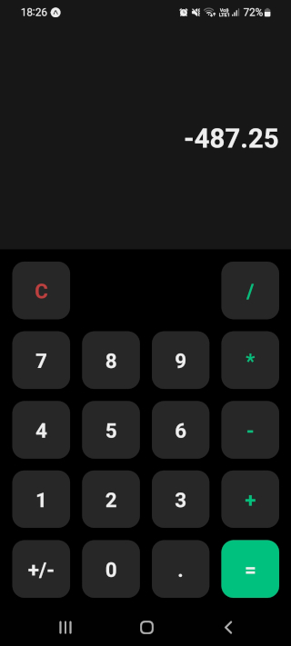

# Calculator

Simple calculator developed in React Native using typescript and styled-components.

With light/dark themes according to the device settings.

## Run

Run in your own android/ios device with the Expo app by accessing [expo.dev/@matheuspuel/calculator](https://expo.dev/@matheuspuel/calculator) and scanning the QR code.

## Preview

